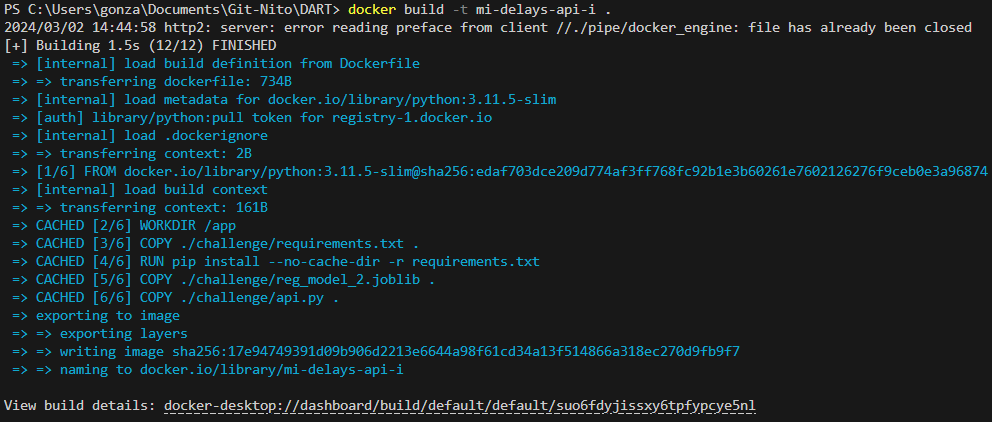
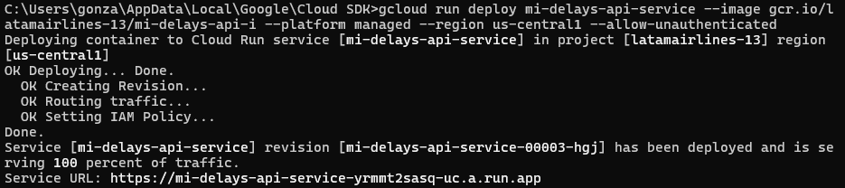
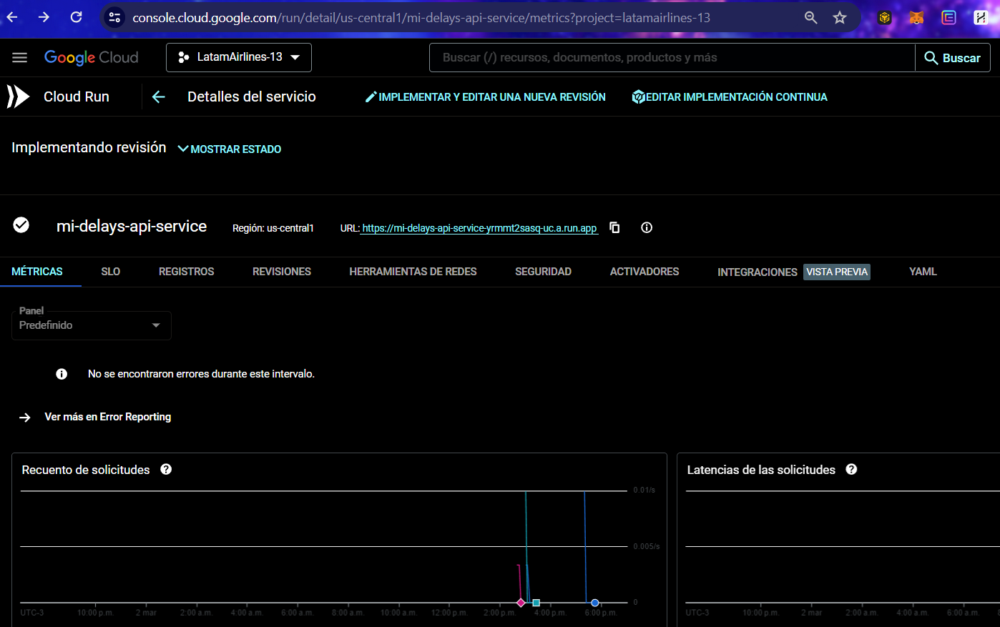
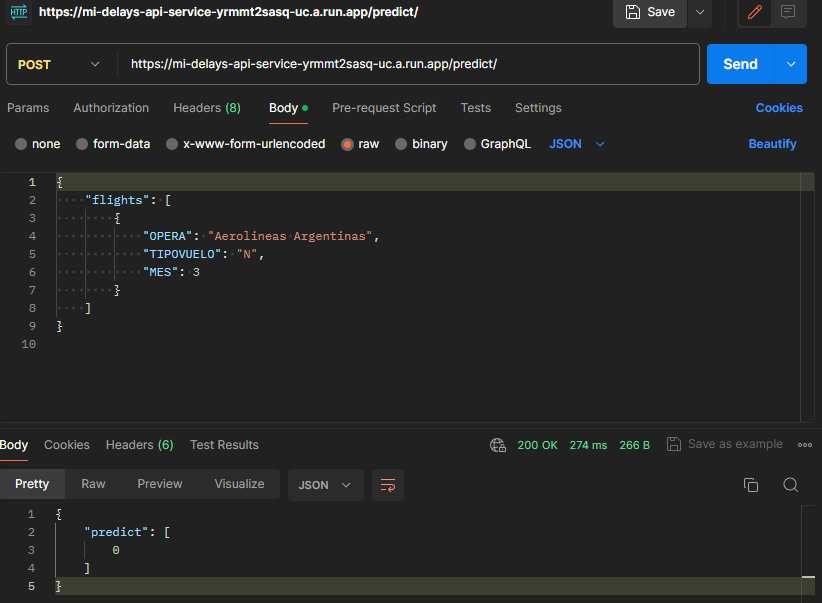

# Model Selection:

I decided to choose the "Logistic Regression model with Feature Importance and Balance" due to its explanatory factor and the speed of logistic regression compared to XGBoost, considering setting up a dynamic retraining pipeline in the future.

Explanation: Logistic Regression is a straightforward and efficient algorithm for classification problems. Its interpretability and faster execution make it suitable for projects where understanding the impact of features is crucial. Compared to more complex models like XGBoost, Logistic Regression can be more manageable and quicker to implement, making it an excellent choice for projects requiring fast deployment and dynamic updating. 

Models that are unbalanced in terms of their data distribution tend to exhibit overfitting, rendering their predictions nonsensical. Consequently, they were discarded because their recall was equal to 1, indicating a perfect recall rate that is unrealistic in practice and suggestive of overfitting.

# Creation of model.py to Pass Unit Tests Successfully:

Explanation: Developing a model.py script is crucial for structuring the machine learning model's code. This script includes the model's training logic, prediction functions, and any necessary data preprocessing. Making it pass unit tests ensures that the model's logic is correct and robust, facilitating maintenance and future enhancements.

# Training and Saving the Model in a .joblib File:

Explanation: Training the model involves adjusting its parameters on a dataset to minimize errors. Once trained, the model is saved using the .joblib format, a standard practice for persisting scikit-learn models. This format is efficient for models that have large numpy arrays internally, as it can be quickly loaded into memory when making predictions.

# Creation of a Specific API with FastAPI to Pass Unit Tests:

Explanation: FastAPI is a modern, fast (high-performance), web framework for building APIs with Python. Creating an API for the model allows for easy integration with other systems and provides a straightforward way for users to interact with the model. Ensuring the API passes unit tests is critical for verifying its functionality and reliability.

# Dockerizing the API into a Specific Docker Image for Deployment on GCP (Google Cloud Platform):

Explanation: Dockerizing the API involves packaging it with all its dependencies into a Docker container. This container can then be deployed consistently across any environment that supports Docker, including GCP. This step is vital for ensuring the API's environment is isolated and reproducible, enhancing the deployment's reliability.

# Creating a Project in GCP: The Project Name is "LatamAirlines-13":

Explanation: Setting up a project in GCP organizes all the resources needed for the application. It acts as a container for the API, Cloud Run service, and any other resources required. Naming the project specifically helps in easily identifying and managing the resources related to this deployment.

# Enabling Cloud Run Service for Deploying the API Inside the Docker Image:

Explanation: Cloud Run is a managed platform in GCP that allows you to deploy containerized applications. Enabling Cloud Run for the project means that you can deploy the API's Docker container easily, allowing it to scale automatically and handle requests over the internet without managing infrastructure.

# Specific Parameter Settings for Successful API Deployment:

Explanation: Adjusting specific parameters for deploying the API includes configuring memory allocation, setting environment variables, and defining access permissions among other settings. This step ensures that the API has all the necessary resources and configurations to run efficiently and securely on Cloud Run.

# Execution of Tests with Postman on the Successfully Deployed API on GCP:

Explanation: Postman is a popular tool for testing API endpoints. By executing tests with Postman, you can verify the deployed API's functionality, ensuring that it responds correctly to requests and behaves as expected. This final step confirms the success of the deployment and the API's readiness for use.

